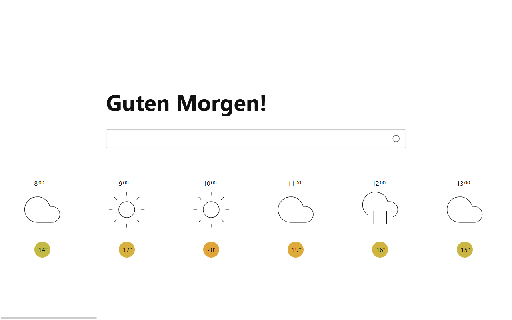

# Weather Duck

## How To Use

1. Open [www.lenaschnedlitz.me/weather-duck](https://www.lenaschnedlitz.me/weather-duck/)
1. Enjoy!

## Contributing - Getting Started

1. Clone the repo.
1. Install dependencies with npm.
1. Run `npm run dev`.

The app is based on [Svelte](https://svelte.dev/).

## FAQ

* *That's nice, but what city or location is the weather report actually for?*  
  The weather report is for Vienna, Austria.  

* *How can I change the location of the weather report?*  
  You can't. This feature will be included in `v2.0`.  

* *Can I change greetings? I don't speak German.*  
  That's not possible at the moment. I want to include this feature in `v2.0`.  

* *Did you come up with these questions yourself?*  
  Yep.

